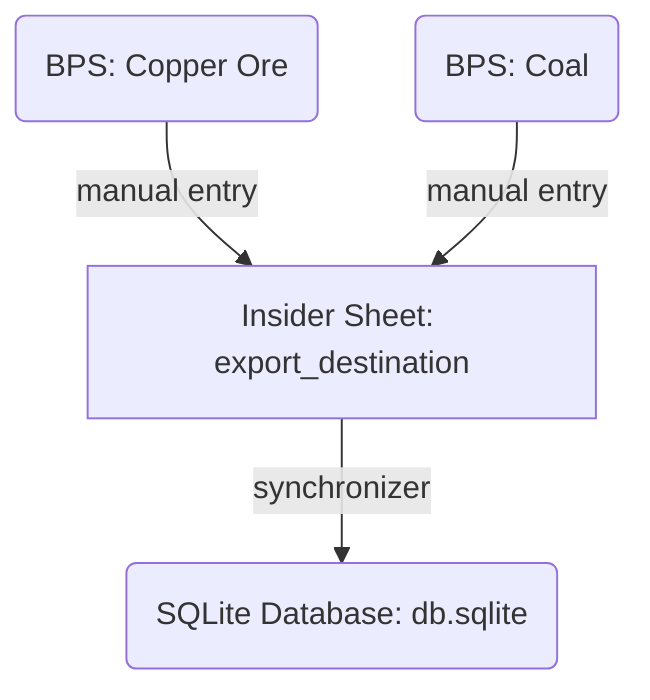
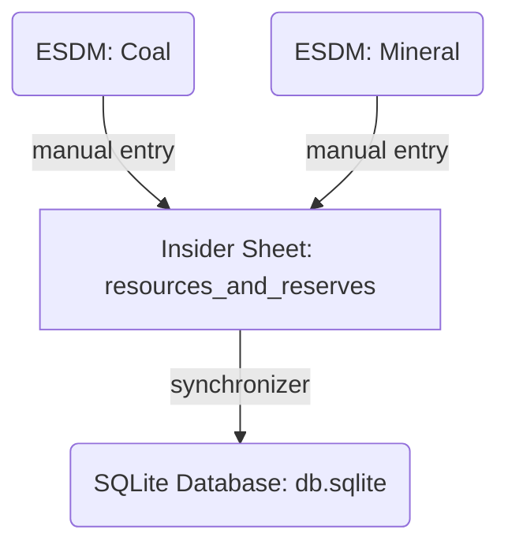
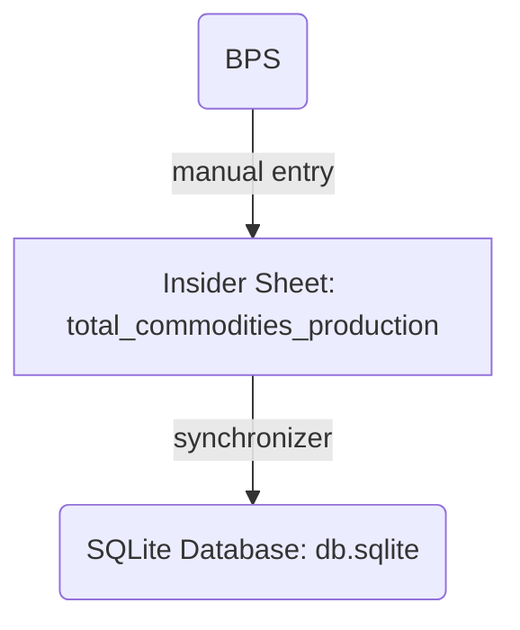

### To install:
```bash
uv sync
```


---
# Insider_Framework
The section below explains the table details

---

## `commodity`

Monthly price history per commodity.

Source:
- non-gold/silver: 
	- This script [minerba_commodities_scraper.py](https://github.com/supertypeai/coalresearch/blob/main/minerba_commodities_scraper.py) scrapes from [ESDM Minerba](https://www.minerba.esdm.go.id/harga_acuan)
	- Running on weekly basis and will automatically sync to `db.sqlite`
- gold & silver: 
	- This script [commodity_gold_silver.py](https://github.com/supertypeai/coalresearch/blob/main/commodity_gold_silver.py) scrapes from [Gold](https://prices.lbma.org.uk/json/gold_am.json) and [Silver](https://prices.lbma.org.uk/json/silver.json)
	- Running on weekly basis and will automatically sync to `db.sqlite`


| **Column**     | **Type**          | **PK** | **Description**                                                                                                                                                       |
| -------------- | ----------------- | ------ | --------------------------------------------------------------------------------------------------------------------------------------------------------------------- |
| `commodity_id` | INTEGER           | Yes    | Commodity identifier.                                                                                                                                                 |
| `name`         | TEXT              | No     | Commodity name (e.g. “Batubara”).                                                                                                                                     |
| `price`        | TEXT (JSON Array) | No     | JSON Array: each element is an object mapping `YYYY-MM-DD`→`price`. <br><br>Example:<br>`[{"2020-06-01": "97.22"},{"2020-07-01": "96.65"},…,{"2025-06-15": "98.61"}]` |


---

## `company`

Basic metadata on mining companies.

Source: 
- Most of the Stuff (Manual Input & Sync): For everything except `mining_license`, and `mining_contract`, we manually enter the data from company annual reports or trusted websites to [Insider Sheets](https://docs.google.com/spreadsheets/d/19wfJ2fc9qKeR22dMIO2rEQLkit8E4bGsHA1u0USqTQk/edit?gid=2011566502#gid=2011566502) in `company` tab. Then, [synchronizer.py](https://github.com/supertypeai/coalresearch/blob/main/synchronizer.py) script transfer this data from [Insider Sheets](https://docs.google.com/spreadsheets/d/19wfJ2fc9qKeR22dMIO2rEQLkit8E4bGsHA1u0USqTQk/edit?gid=2011566502#gid=2011566502) into the `db.sqlite`.
- The 'mining_license' data is dynamically sourced from the [esdm_minerba.py](https://github.com/supertypeai/coalresearch/blob/main/scrapper/esdm_minerba.py) script, which will scrape https://geoportal.esdm.go.id website. This script operates on a weekly basis, generating the [esdm_minerba_all.csv](https://github.com/supertypeai/coalresearch/blob/main/esdm_minerba_all.csv) output. Subsequently, the [synchronizer.py](https://github.com/supertypeai/coalresearch/blob/main/synchronizer.py) script transfer this data from the CSV to a [Insider Sheets](https://docs.google.com/spreadsheets/d/19wfJ2fc9qKeR22dMIO2rEQLkit8E4bGsHA1u0USqTQk/edit?gid=2011566502#gid=2011566502), which is then replicated into the `db.sqlite`.
- mining_contract: Manual input to the [Insider Sheets](https://docs.google.com/spreadsheets/d/19wfJ2fc9qKeR22dMIO2rEQLkit8E4bGsHA1u0USqTQk/edit?gid=2011566502#gid=2011566502), especially on `mining_contract` tab. Then, [synchronizer.py](https://github.com/supertypeai/coalresearch/blob/main/synchronizer.py) script transfer this data from [Insider Sheets](https://docs.google.com/spreadsheets/d/19wfJ2fc9qKeR22dMIO2rEQLkit8E4bGsHA1u0USqTQk/edit?gid=2011566502#gid=2011566502) into the `db.sqlite`. 


Notes: Currently running semi-manually to sync to `db.sqlite` every time there is changes on the [Insider Sheets](https://docs.google.com/spreadsheets/d/19wfJ2fc9qKeR22dMIO2rEQLkit8E4bGsHA1u0USqTQk/edit?gid=2011566502#gid=2011566502)

| **Column**               | **Type**          | **PK** | **Description**                                 |
| ------------------------ | ----------------- | ------ | ----------------------------------------------- |
| `id`                     | INTEGER           | Yes    | Company identifier.                             |
| `name`                   | TEXT              | No     | Official company name.                          |
| `idx_ticker`             | TEXT              | No     | IDX stock ticker (if listed).                   |
| `operation_province`     | TEXT              | No     | Province of main operations.                    |
| `operation_kabkot`       | TEXT              | No     | Regency/City of operations.                     |
| `representative_address` | TEXT              | No     | Registered corporate address.                   |
| `company_type`           | TEXT              | No     | e.g. “Holding”, “Trader”.                       |
| `key_operation`          | TEXT              | No     | Primary business line (e.g. “Coal Trading”).    |
| `activities`             | TEXT (JSON Array) | No     | List of activity strings (e.g. `["Trading"]`).  |
| `website`                | TEXT              | No     | Corporate website URL.                          |
| `phone_number`           | TEXT              | No     | Contact phone.                                  |
| `email`                  | TEXT              | No     | Contact email.                                  |
| `mining_license`         | TEXT (JSON Array) | No     | List of linked license IDs.                     |
| `mining_contract`        | TEXT (JSON Array) | No     | List of contractor IDs.                         |
| `commodity`              | TEXT (JSON Array) | No     | List of commodities produced (e.g. `["Coal"]`). |


---

## `company_ownership`

Stores ownership percentages between companies.

Source: 
- Source of the data in this table is from company annual reports or trusted websites moved to [Insider Sheets](https://docs.google.com/spreadsheets/d/19wfJ2fc9qKeR22dMIO2rEQLkit8E4bGsHA1u0USqTQk/edit?gid=2011566502#gid=2011566502) at `company_ownership` tab. Then, [synchronizer.py](https://github.com/supertypeai/coalresearch/blob/main/synchronizer.py) script transfer this data from [Insider Sheets](https://docs.google.com/spreadsheets/d/19wfJ2fc9qKeR22dMIO2rEQLkit8E4bGsHA1u0USqTQk/edit?gid=2011566502#gid=2011566502) into the `db.sqlite`.

Notes: Currently running semi-manually to sync to `db.sqlite` every time there is changes on the [Insider Sheets](https://docs.google.com/spreadsheets/d/19wfJ2fc9qKeR22dMIO2rEQLkit8E4bGsHA1u0USqTQk/edit?gid=2011566502#gid=2011566502)

| **Column**             | **Type**      | **PK**  | **Description**                                                     |
| ---------------------- | ------------- | ------- | ------------------------------------------------------------------- |
| `parent_company_id`    | INTEGER       | Yes (1) | ID of the holding/parent company (↔︎ `company.id`).                 |
| `company_id`           | INTEGER       | Yes (2) | ID of the subsidiary company (↔︎ `company.id`).                     |
| `percentage_ownership` | DECIMAL(10,5) | No      | Ownership stake (%) that `parent_company_id` holds in `company_id`. |


---

## `company_performance`

Yearly production/sales stats per company in JSON.

Source: 
- Source of the data in this table is from company annual reports or trusted websites moved to [Insider Sheets](https://docs.google.com/spreadsheets/d/19wfJ2fc9qKeR22dMIO2rEQLkit8E4bGsHA1u0USqTQk/edit?gid=2011566502#gid=2011566502) at `company_performance` tab. Then, [synchronizer.py](https://github.com/supertypeai/coalresearch/blob/main/synchronizer.py) script transfer this data from [Insider Sheets](https://docs.google.com/spreadsheets/d/19wfJ2fc9qKeR22dMIO2rEQLkit8E4bGsHA1u0USqTQk/edit?gid=2011566502#gid=2011566502) into the `db.sqlite`.
- commodity_stats: Manual input to the [Insider Sheets](https://docs.google.com/spreadsheets/d/19wfJ2fc9qKeR22dMIO2rEQLkit8E4bGsHA1u0USqTQk/edit?gid=2011566502#gid=2011566502), especially on `company_performance` tab with the column that has `*`. Then, [synchronizer.py](https://github.com/supertypeai/coalresearch/blob/main/synchronizer.py) script transfer this data from [Insider Sheets](https://docs.google.com/spreadsheets/d/19wfJ2fc9qKeR22dMIO2rEQLkit8E4bGsHA1u0USqTQk/edit?gid=2011566502#gid=2011566502) into the `db.sqlite`. 

Notes: Currently running semi-manually to sync to `db.sqlite` every time there is changes on the [Insider Sheets](https://docs.google.com/spreadsheets/d/19wfJ2fc9qKeR22dMIO2rEQLkit8E4bGsHA1u0USqTQk/edit?gid=2011566502#gid=2011566502)


| **Column**           | **Type**    | **PK** | **Description**                                                                                                                                                                                                                                                                                                                                                                                                                                                                                                                                                                                                                                                                                                                                                                                                                                                                                                                      |
| -------------------- | ----------- | ------ | ------------------------------------------------------------------------------------------------------------------------------------------------------------------------------------------------------------------------------------------------------------------------------------------------------------------------------------------------------------------------------------------------------------------------------------------------------------------------------------------------------------------------------------------------------------------------------------------------------------------------------------------------------------------------------------------------------------------------------------------------------------------------------------------------------------------------------------------------------------------------------------------------------------------------------------ |
| `id`                 | INTEGER     | Yes    | Record identifier.                                                                                                                                                                                                                                                                                                                                                                                                                                                                                                                                                                                                                                                                                                                                                                                                                                                                                                                   |
| `company_id`         | INTEGER     | No     | Company reference (↔︎ `company.id`).                                                                                                                                                                                                                                                                                                                                                                                                                                                                                                                                                                                                                                                                                                                                                                                                                                                                                                 |
| `year`               | INTEGER     | No     | Reporting year.                                                                                                                                                                                                                                                                                                                                                                                                                                                                                                                                                                                                                                                                                                                                                                                                                                                                                                                      |
| `commodity_type`     | TEXT        | No     | Commodity produced (e.g. “Coal”).                                                                                                                                                                                                                                                                                                                                                                                                                                                                                                                                                                                                                                                                                                                                                                                                                                                                                                    |
| `commodity_sub_type` | TEXT        | No     | Sub-category (e.g. “Sub-Bituminous”).                                                                                                                                                                                                                                                                                                                                                                                                                                                                                                                                                                                                                                                                                                                                                                                                                                                                                                |
| `commodity_stats`    | TEXT (JSON) | No     | The commodity_stats column is a TEXT field that stores dynamic JSON objects. This means its content and structure can vary based on the specific commodity_type and commodity_sub_type.<br><br>Includes:<br>- **Operational Metrics:** Such as `mining_operation_status`, `production_volume`, `sales_volume`, `overburden_removal_volume`, and `strip_ratio`.<br>- **Resources & Reserves:** A nested object detailing `total_reserve`, `total_resource`, and breakdowns like `resources_inferred`, `resources_indicated`, `resources_measured`, `reserves_proved`, and `reserves_probable`.<br>- **Product Specifications:** An array of objects, where each object describes a specific product with its quality parameters (e.g., `product_name`, `calorific_value`, `total_moisture`, various `ash_content` and `sulphur_content` metrics, etc.). These specific fields are dynamic and will change depending on the commodity. |


---

## `export_destination`

Yearly export values by country and commodity type.

Source: 
- Source of the data in this table is from trusted source, specifically from:
	1. [BPS Copper Ore](https://www.bps.go.id/en/statistics-table/1/MTAzMiMx/exports-of-copper-ore-by-major-countries-of-destination--2012-2023.html) 
	2. [BPS Coal](https://www.bps.go.id/en/statistics-table/1/MTAzNCMx/exports-of-coal-by-major-countries-of-destination--2012-2023.html) 
	3. Gold

And then moved to [Insider Sheets: export_destination](https://docs.google.com/spreadsheets/d/19wfJ2fc9qKeR22dMIO2rEQLkit8E4bGsHA1u0USqTQk/edit?gid=847935271#gid=847935271) at `export_destination` tab. Then, [synchronizer.py](https://github.com/supertypeai/coalresearch/blob/main/synchronizer.py) script transfer this data from [Insider Sheets: export_destination](https://docs.google.com/spreadsheets/d/19wfJ2fc9qKeR22dMIO2rEQLkit8E4bGsHA1u0USqTQk/edit?gid=847935271#gid=847935271) into the `db.sqlite`.

Notes: 
- Currently running semi-manually to sync to `db.sqlite` every time there is changes on the [Insider Sheets: export_destination](https://docs.google.com/spreadsheets/d/19wfJ2fc9qKeR22dMIO2rEQLkit8E4bGsHA1u0USqTQk/edit?gid=847935271#gid=847935271)
- Export volume units:
	- export destination: export volume BPS `Coal`: x 1000 ton
	- export destination: export volume BPS `Copper`: x 1 ton
- The Copper Ore one, is translated to `commodity = Copper` on the db. Probably need to verify this

Data Flow:


| **Column**           | **Type**      | **PK** | **Description**                             |
| -------------------- | ------------- | ------ | ------------------------------------------- |
| `id`                 | INTEGER       | Yes    | Unique row identifier.                      |
| `country`            | TEXT          | No     | Destination country name.                   |
| `year`               | INTEGER       | No     | Calendar year of the data.                  |
| `commodity_type`     | TEXT          | No     | Commodity category (e.g. “Coal”, "Copper"). |
| `export_USD`         | DECIMAL(10,5) | No     | Export value in million USD.                |
| `export_volume_BPS`  | DECIMAL(10,5) | No     | Export volume per BPS measure.              |
| `export_volume_ESDM` | DECIMAL(10,5) | No     | Export volume per ESDM reporting.           |


---

## `global_commodity_data`

Global stats by country, including JSON for reserves, trade and production.

Source: 
- Source of the data in this table is from trusted websites, specifically from [EnergyInst Organization](https://www.energyinst.org/statistical-review/resources-and-data-downloads), and [Gold Organization](https://www.gold.org/goldhub/data/gold-production-by-country#registration-type=google&just-verified=1) for production volume, EI-Stats-Review-All-Data.xlsx for resources and reserves, and https://trendeconomy.com for export & import data, and then moved to [Insider Sheets](https://docs.google.com/spreadsheets/d/19wfJ2fc9qKeR22dMIO2rEQLkit8E4bGsHA1u0USqTQk/edit?gid=2011566502#gid=2011566502) at `global_commodity_data` tab. Then, [synchronizer.py](https://github.com/supertypeai/coalresearch/blob/main/synchronizer.py) script transfer this data from [Insider Sheets](https://docs.google.com/spreadsheets/d/19wfJ2fc9qKeR22dMIO2rEQLkit8E4bGsHA1u0USqTQk/edit?gid=2011566502#gid=2011566502) into the `db.sqlite`.

Notes: 
- Currently running semi-manually to sync to `db.sqlite` every time there is changes on the [Insider Sheets](https://docs.google.com/spreadsheets/d/19wfJ2fc9qKeR22dMIO2rEQLkit8E4bGsHA1u0USqTQk/edit?gid=2011566502#gid=2011566502)
- There is several table under the `global_commodity_data` tab. The script [global_commodity_data_merge.py](https://github.com/supertypeai/coalresearch/blob/main/sheet_api/global_commodity_data_merge.py) takes all that info and merges it into one big table in columns A to F.

| **Column**           | **Type**    | **PK** | **Description**                                                                                   |
| -------------------- | ----------- | ------ | ------------------------------------------------------------------------------------------------- |
| `id`                 | INTEGER     | Yes    | Unique record ID.                                                                                 |
| `country`            | TEXT        | No     | Country name.                                                                                     |
| `resources_reserves` | TEXT (JSON) | No     | JSON: mapping years → list of `{type: value}` objects (e.g. `{"2020":[{"Anthracite":73719},…]}`). |
| `export_import`      | TEXT (JSON) | No     | JSON: mapping years → `[{"Export":…},{"Import":…}]`.                                              |
| `production_volume`  | TEXT (JSON) | No     | JSON: mapping years → numeric volumes (e.g. `{"2013":428.9,…,"2023":455.8}`).                     |
| `commodity_type`     | TEXT        | No     | Commodity category (e.g. “Coal”, “Copper”, “Nickel”).                                             |


---

## `mining_contract`

Maps mine owners to contractors with contract end dates.

Source: 
- Source of the data in this table is from company annual reports or trusted websites moved to [Insider Sheets](https://docs.google.com/spreadsheets/d/19wfJ2fc9qKeR22dMIO2rEQLkit8E4bGsHA1u0USqTQk/edit?gid=2011566502#gid=2011566502) at `mining_contract` tab. Then, [synchronizer.py](https://github.com/supertypeai/coalresearch/blob/main/synchronizer.py) script transfer this data from [Insider Sheets](https://docs.google.com/spreadsheets/d/19wfJ2fc9qKeR22dMIO2rEQLkit8E4bGsHA1u0USqTQk/edit?gid=2011566502#gid=2011566502) into the `db.sqlite`.

Notes: Currently running semi-manually to sync to `db.sqlite` every time there is changes on the [Insider Sheets](https://docs.google.com/spreadsheets/d/19wfJ2fc9qKeR22dMIO2rEQLkit8E4bGsHA1u0USqTQk/edit?gid=2011566502#gid=2011566502)

| **Column**            | **Type** | **PK**  | **Description**                                 |
| --------------------- | -------- | ------- | ----------------------------------------------- |
| `mine_owner_id`       | INTEGER  | Yes (1) | Company ID of the mine owner (↔︎ `company.id`). |
| `contractor_id`       | INTEGER  | Yes (2) | Company ID of the contractor (↔︎ `company.id`). |
| `contract_period_end` | TEXT     | No      | Contract expiration date (YYYY-MM-DD).          |


---

## `mining_license`

Company mining permits.

Source: 
- The 'mining_license' data is sourced from the [esdm_minerba.py](https://github.com/supertypeai/coalresearch/blob/main/scrapper/esdm_minerba.py) script, which will scrape https://geoportal.esdm.go.id website. This script operates on a weekly basis, generating the [esdm_minerba_all.csv](https://github.com/supertypeai/coalresearch/blob/main/esdm_minerba_all.csv) output. Subsequently, the [sort_mining_license.py](https://github.com/supertypeai/coalresearch/blob/main/scrapper/sort_mining_license.py) script (also running in weekly basis) transfer this data from the CSV directly to `db.sqlite`.

| **Column**              | **Type** | **PK** | **Description**                                         |
| ----------------------- | -------- | ------ | ------------------------------------------------------- |
| `id`                    | TEXT     | Yes    | License identifier.                                     |
| `license_type`          | TEXT     | No     | e.g. “IUP”.                                             |
| `license_number`        | TEXT     | No     | Official permit number.                                 |
| `province`              | TEXT     | No     | Permit location province.                               |
| `city`                  | TEXT     | No     | Permit location city/regency.                           |
| `permit_effective_date` | TEXT     | No     | Start date (YYYY-MM-DD).                                |
| `permit_expiry_date`    | TEXT     | No     | End date (YYYY-MM-DD).                                  |
| `activity`              | TEXT     | No     | Activity phase (e.g. “Operasi Produksi”, “Eksplorasi”). |
| `licensed_area`         | DECIMAL  | No     | Area in hectares.                                       |
| `location`              | TEXT     | No     | Detailed location description.                          |
| `commodity`             | TEXT     | No     | Commodity covered (e.g. “Coal”, “Nickel”).              |
| `company_name`          | TEXT     | No     | Name of licensee company.                               |
| `company_id`            | INTEGER  | No     | Back-reference to `company.id` (if available).          |


---

## `mining_site`

Details of individual mining sites, including JSON-encoded reserves and location.

Source: 
- Source of the data in this table is from trusted websites, specifically from https://georima.esdm.go.id website, which then moved to [Insider Sheets](https://docs.google.com/spreadsheets/d/19wfJ2fc9qKeR22dMIO2rEQLkit8E4bGsHA1u0USqTQk/edit?gid=2011566502#gid=2011566502) at `mining_site` tab. Then, [synchronizer.py](https://github.com/supertypeai/coalresearch/blob/main/synchronizer.py) script transfer this data from [Insider Sheets](https://docs.google.com/spreadsheets/d/19wfJ2fc9qKeR22dMIO2rEQLkit8E4bGsHA1u0USqTQk/edit?gid=2011566502#gid=2011566502) into the `db.sqlite`.

Notes: Currently running semi-manually to sync to `db.sqlite` every time there is changes on the [Insider Sheets](https://docs.google.com/spreadsheets/d/19wfJ2fc9qKeR22dMIO2rEQLkit8E4bGsHA1u0USqTQk/edit?gid=2011566502#gid=2011566502)

| **Column**                  | **Type**      | **PK** | **Description**                                                                                                                                                                                                                                                                                                                                                                                                                                                                                                                                                                                                                                                                                                                                                                                                                                                                                                                                         |
| --------------------------- | ------------- | ------ | ------------------------------------------------------------------------------------------------------------------------------------------------------------------------------------------------------------------------------------------------------------------------------------------------------------------------------------------------------------------------------------------------------------------------------------------------------------------------------------------------------------------------------------------------------------------------------------------------------------------------------------------------------------------------------------------------------------------------------------------------------------------------------------------------------------------------------------------------------------------------------------------------------------------------------------------------------- |
| `id`                        | INTEGER       | Yes    | Unique site identifier.                                                                                                                                                                                                                                                                                                                                                                                                                                                                                                                                                                                                                                                                                                                                                                                                                                                                                                                                 |
| `name`                      | TEXT          | No     | Site name.                                                                                                                                                                                                                                                                                                                                                                                                                                                                                                                                                                                                                                                                                                                                                                                                                                                                                                                                              |
| `project_name`              | TEXT          | No     | Named project (if any).                                                                                                                                                                                                                                                                                                                                                                                                                                                                                                                                                                                                                                                                                                                                                                                                                                                                                                                                 |
| `year`                      | INTEGER       | No     | Reporting year.                                                                                                                                                                                                                                                                                                                                                                                                                                                                                                                                                                                                                                                                                                                                                                                                                                                                                                                                         |
| `mineral_type`              | TEXT          | No     | Type of mineral (e.g. “Coal”).                                                                                                                                                                                                                                                                                                                                                                                                                                                                                                                                                                                                                                                                                                                                                                                                                                                                                                                          |
| `company_id`                | INTEGER       | No     | Owning company (↔︎ `company.id`).                                                                                                                                                                                                                                                                                                                                                                                                                                                                                                                                                                                                                                                                                                                                                                                                                                                                                                                       |
| `production_volume`         | DECIMAL(10,5) | No     | Volume produced that year.                                                                                                                                                                                                                                                                                                                                                                                                                                                                                                                                                                                                                                                                                                                                                                                                                                                                                                                              |
| `overburden_removal_volume` | DECIMAL(10,5) | No     | Volume of overburden removed.                                                                                                                                                                                                                                                                                                                                                                                                                                                                                                                                                                                                                                                                                                                                                                                                                                                                                                                           |
| `strip_ratio`               | DECIMAL(10,5) | No     | Overburden/ore ratio.                                                                                                                                                                                                                                                                                                                                                                                                                                                                                                                                                                                                                                                                                                                                                                                                                                                                                                                                   |
| `resources_reserves`        | TEXT (JSON)   | No     | A JSON string containing detailed information about the mineral resources and reserves, including:<br><br>- `year_measured`: The year the resources/reserves were measured.<br>- `calorific_value`: The energy content of the coal (if `mineral_type` is Coal).<br>- `total_reserve`: Total proven and probable reserves.<br>- `total_resource`: Total measured, indicated, and inferred resources.<br>- `resources_inferred`: Estimated resources based on limited geological evidence.<br>- `resources_indicated`: Resources estimated with a moderate level of geological confidence.<br>- `resources_measured`: Resources estimated with a high level of geological confidence.<br>- `reserves_proved`: Quantities of mineral that can be economically and legally extracted with a high degree of confidence.<br>- `reserves_probable`: Quantities of mineral that can be economically and legally extracted with a moderate degree of confidence. |
| `location`                  | TEXT (JSON)   | No     | A JSON string containing geographical information about the mining site, including:<br><br>- `province`: The province where the mining site is located.<br>- `city`: The city or regency within the province.<br>- `latitude`: The geographical latitude coordinate of the site.<br>- `longitude`: The geographical longitude coordinate of the site.                                                                                                                                                                                                                                                                                                                                                                                                                                                                                                                                                                                                   |


---

## `resources_and_reserves`

Provincial-level resource/reserve statistics.

Source: 
- Source of the data in this table is from company annual reports or trusted websites. 
	- Coal:  
		1. [ESDM: Coal Handbook 2023](https://www.esdm.go.id/assets/media/content/content-handbook-of-energy-and-economic-statistics-of-indonesia-2023.pdf)
		2. [ESDM: Coal Handbook 2024](https://www.esdm.go.id/assets/media/content/content-handbook-of-energy-and-economic-statistics-of-indonesia-2024.pdf)
	- Metal Minerals:
		1. [ESDM: Sumber Daya dan Cadangan Mineral dan Batubara Indonesia Tahun 2025](https://geologi.esdm.go.id/storage/publikasi/JNMrP75x2gPzuli5paCho7uAfJbRpU4ZuOB2pLE7.pdf)

They then moved to [Insider Sheets: resources_and_reserves](https://docs.google.com/spreadsheets/d/19wfJ2fc9qKeR22dMIO2rEQLkit8E4bGsHA1u0USqTQk/edit?gid=2049719033#gid=2049719033) at `resources_and_reserves` tab. Then, [synchronizer.py](https://github.com/supertypeai/coalresearch/blob/main/synchronizer.py) script transfer this data from [Insider Sheets: resources_and_reserves](https://docs.google.com/spreadsheets/d/19wfJ2fc9qKeR22dMIO2rEQLkit8E4bGsHA1u0USqTQk/edit?gid=2049719033#gid=2049719033) into the `db.sqlite`.

Notes: Currently running semi-manually to sync to `db.sqlite` every time there is changes on the [Insider Sheets: resources_and_reserves](https://docs.google.com/spreadsheets/d/19wfJ2fc9qKeR22dMIO2rEQLkit8E4bGsHA1u0USqTQk/edit?gid=2049719033#gid=2049719033)

Data Flow:



| **Column**                 | **Type**      | **PK** | **Description**                               |
| -------------------------- | ------------- | ------ | --------------------------------------------- |
| `id`                       | INTEGER       | Yes    | Unique identifier.                            |
| `province`                 | TEXT          | No     | Province name.                                |
| `year`                     | INTEGER       | No     | Reporting year.                               |
| `commodity_type`           | TEXT          | No     | Commodity type (e.g., "Coal", "Nickel").      |
| `exploration_target_1`     | DECIMAL(10,5) | No     | Early-stage exploration target.               |
| `total_inventory_1`        | DECIMAL(10,5) | No     | Raw total inventory estimate.                 |
| `ore_resources_inferred`   | DECIMAL(10,5) | No     | Ore volume classified as inferred.            |
| `resources_inferred`       | DECIMAL(10,5) | No     | Contained metal (inferred resource).          |
| `ore_resources_indicated`  | DECIMAL(10,5) | No     | Ore volume classified as indicated.           |
| `resources_indicated`      | DECIMAL(10,5) | No     | Contained metal (indicated resource).         |
| `ore_resources_measured`   | DECIMAL(10,5) | No     | Ore volume classified as measured.            |
| `resources_measured`       | DECIMAL(10,5) | No     | Contained metal (measured resource).          |
| `ore_resources_total`      | DECIMAL(10,5) | No     | Sum of all ore resource categories.           |
| `resources_total`          | DECIMAL(10,5) | No     | Sum of all contained metal resources.         |
| `resources_total_verify_2` | DECIMAL(10,5) | No     | Government-verified total resources.          |
| `ore_reserves_probable`    | DECIMAL(10,5) | No     | Ore volume classified as probable reserve.    |
| `reserves_probable`        | DECIMAL(10,5) | No     | Contained metal (probable reserve).           |
| `ore_reserves_proven`      | DECIMAL(10,5) | No     | Ore volume classified as proven reserve.      |
| `reserves_proven`          | DECIMAL(10,5) | No     | Contained metal (proven reserve).             |
| `ore_reserves_total`       | DECIMAL(10,5) | No     | Total ore reserves (proven + probable).       |
| `reserves_total`           | DECIMAL(10,5) | No     | Total contained reserves (proven + probable). |
| `reserves_total_verify_2`  | DECIMAL(10,5) | No     | Government-verified total reserves.           |

---

## `total_commodities_production`

Annual national-level production volumes.

Source: 
- Source of the data in this table is from trusted websites, specifically from [BPS Mineral Mining](https://www.bps.go.id/en/statistics-table/2/NTA4IzI=/production-of-minerals-mining.html), and then moved to [Insider Sheets: total_commodities_production](https://docs.google.com/spreadsheets/d/19wfJ2fc9qKeR22dMIO2rEQLkit8E4bGsHA1u0USqTQk/edit?gid=1364183975#gid=1364183975) at `total_commodities_production` tab. Then, [synchronizer.py](https://github.com/supertypeai/coalresearch/blob/main/synchronizer.py) script transfer this data from [Insider Sheets: total_commodities_production](https://docs.google.com/spreadsheets/d/19wfJ2fc9qKeR22dMIO2rEQLkit8E4bGsHA1u0USqTQk/edit?gid=1364183975#gid=1364183975) into the `db.sqlite`.

Notes: 
- Currently running semi-manually to sync to `db.sqlite` every time there is changes on the [Insider Sheets - total_commodity_production](https://docs.google.com/spreadsheets/d/19wfJ2fc9qKeR22dMIO2rEQLkit8E4bGsHA1u0USqTQk/edit?gid=1364183975#gid=1364183975)
- Specifically for `commodity_type = Copper` , it refers to Copper Concentrate 

Data Flow:




| **Column**          | **Type**      | **PK** | **Description**                        |
| ------------------- | ------------- | ------ | -------------------------------------- |
| `id`                | INTEGER       | Yes    | Unique record ID.                      |
| `commodity_type`    | TEXT          | No     | Commodity name (e.g. “Coal”).          |
| `production_volume` | DECIMAL(10,5) | No     | Volume produced (in million units).    |
| `unit`              | TEXT          | No     | Unit of measure (e.g. “Million Tons”). |
| `year`              | INTEGER       | No     | Reporting year.                        |
