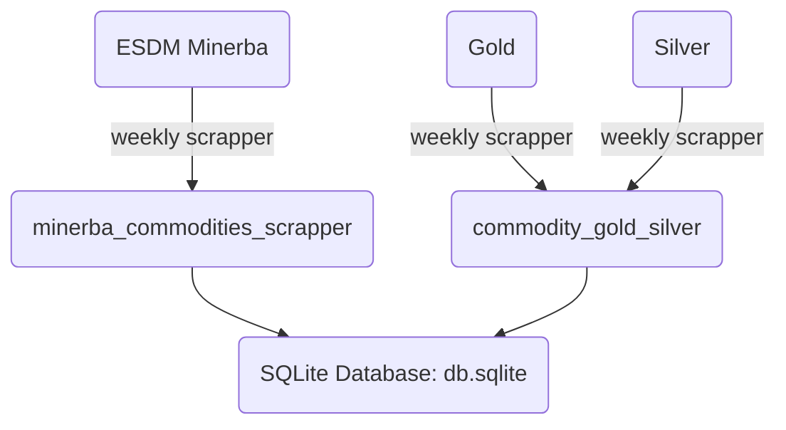
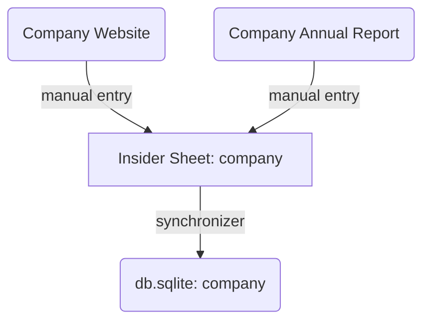
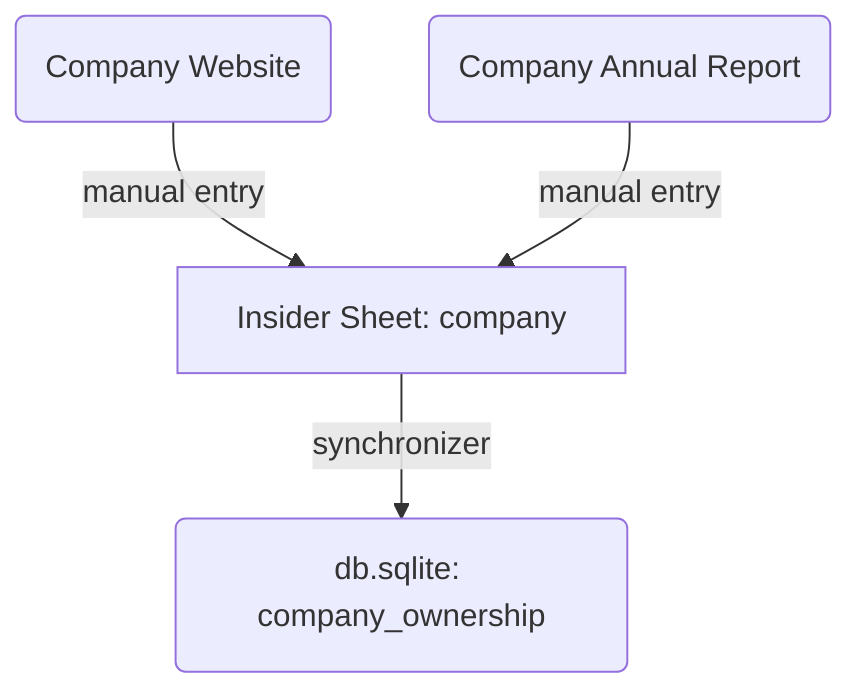
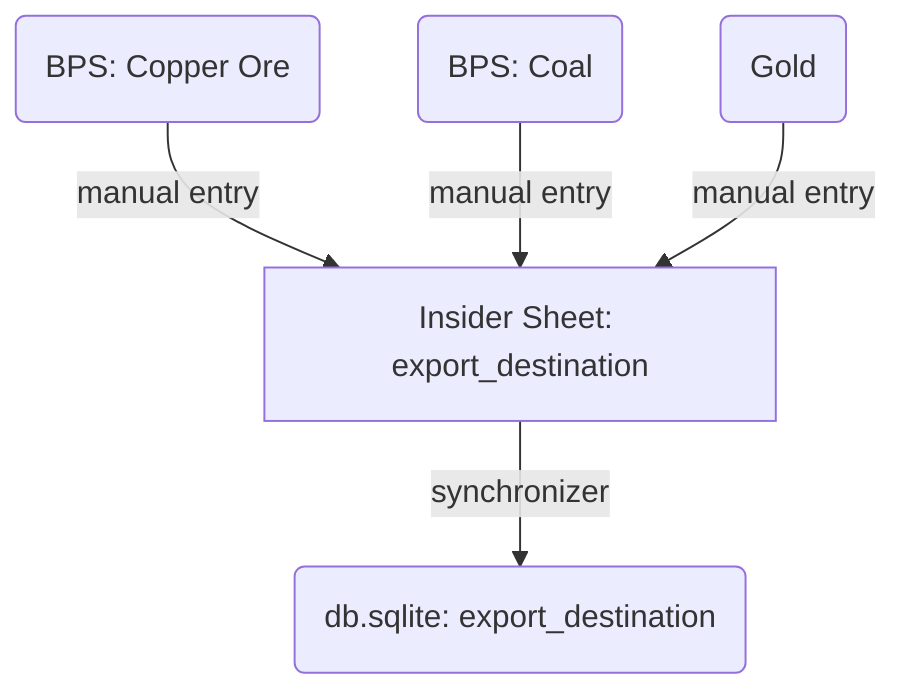
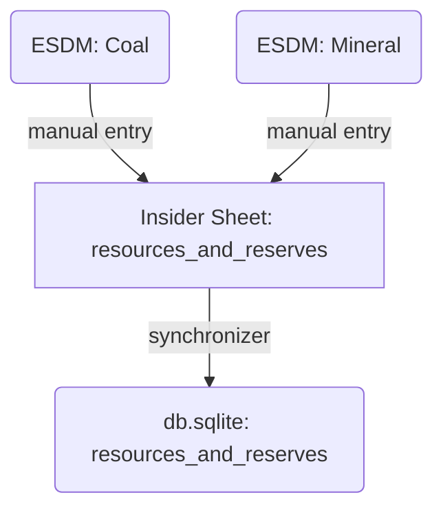
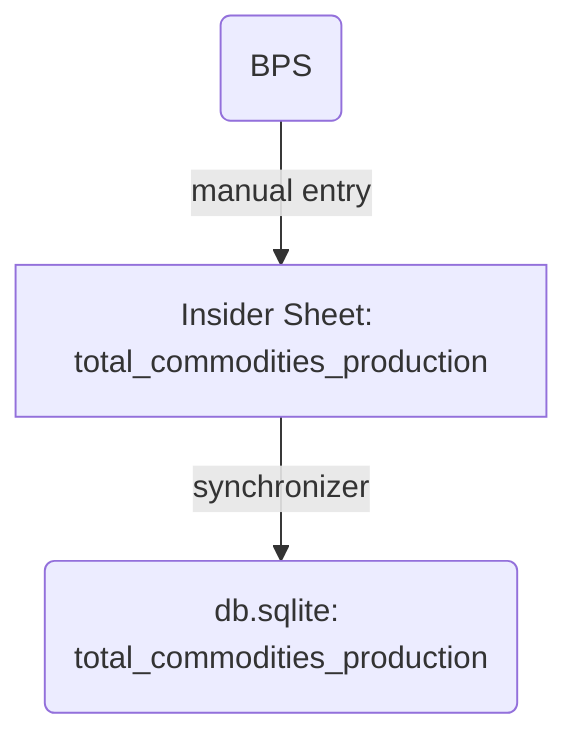
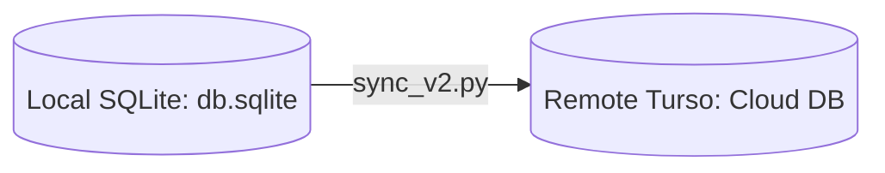

### To install:
```bash
uv sync
```


---
# Insider_Framework
The section below explains the table details

---

## `commodity_price`

Monthly price history per commodity.

Source:
- non-gold/silver: 
	- This script [commodity_price.py](https://github.com/supertypeai/coalresearch/blob/main/tables/commodity_price.py) scrapes from [ESDM Minerba](https://www.minerba.esdm.go.id/harga_acuan)
	- Running on weekly basis and will automatically sync to `db.sqlite`
- gold & silver: 
	- This script [commodity_price.py](https://github.com/supertypeai/coalresearch/blob/main/tables/commodity_price.py)  also scrapes from [Gold](https://prices.lbma.org.uk/json/gold_am.json) and [Silver](https://prices.lbma.org.uk/json/silver.json)
	- Running on weekly basis and will automatically sync to `db.sqlite`

Data Flow:

```mermaid
graph TD
  A1(ESDM Minerba) --> |weekly scrapper| B1 
  A2(Gold) --> |weekly scrapper| B2
  A3(Silver) -->|weekly scrapper| B2
  B1(minerba_commodities_scrapper) --> C(SQLite Database: db.sqlite)
  B2(commodity_gold_silver) --> C(SQLite Database: db.sqlite)

  %% Add clickable links to each node
  click A1 "https://www.minerba.esdm.go.id/harga_acuan" _blank
  click A2 "https://prices.lbma.org.uk/json/gold_am.json" _blank
  click A3 "https://prices.lbma.org.uk/json/silver.json" _blank
  click B1 "https://github.com/supertypeai/coalresearch/blob/main/tables/commodity_price.py" _blank
  click B2 "https://github.com/supertypeai/coalresearch/blob/main/tables/commodity_price.py" _blank
```

| **Column**     | **Type**          | **PK** | **Description**                                                                                                                                                       |
| -------------- | ----------------- | ------ | --------------------------------------------------------------------------------------------------------------------------------------------------------------------- |
| `name`         | TEXT              | Yes(1) | Commodity name (e.g. “Batubara”).                                                                                                                                     |
| `date`         | TEXT              | Yes(2) | Date of the price (YYYY-MM-DD).                                                                                                                                       |
| `price`        | REAL              | No     | Price value.                                                       |


---

## `company`

Basic metadata on mining companies with URL-friendly slug support.

Source: 
- Most of the Stuff (Manual Input & Sync): For everything except `mining_license`, and `mining_contract`, we manually enter the data from company annual reports or trusted websites to [Insider Sheets](https://docs.google.com/spreadsheets/d/19wfJ2fc9qKeR22dMIO2rEQLkit8E4bGsHA1u0USqTQk/edit?gid=2011566502#gid=2011566502) in `company` tab. Then, [synchronizer.py](https://github.com/supertypeai/coalresearch/blob/main/synchronizer.py) script transfer this data from [Insider Sheets](https://docs.google.com/spreadsheets/d/19wfJ2fc9qKeR22dMIO2rEQLkit8E4bGsHA1u0USqTQk/edit?gid=2011566502#gid=2011566502) into the `db.sqlite`.
- The 'mining_license' data is dynamically sourced from the [esdm_minerba.py](https://github.com/supertypeai/coalresearch/blob/main/scrapper/esdm_minerba.py) script, which will scrape https://geoportal.esdm.go.id website. This script operates on a weekly basis, generating the [esdm_minerba_all.csv](https://github.com/supertypeai/coalresearch/blob/main/datasets/esdm_minerba_all.csv) output. Subsequently, the [synchronizer.py](https://github.com/supertypeai/coalresearch/blob/main/synchronizer.py) script transfer this data from the CSV to a [Insider Sheets](https://docs.google.com/spreadsheets/d/19wfJ2fc9qKeR22dMIO2rEQLkit8E4bGsHA1u0USqTQk/edit?gid=2011566502#gid=2011566502), which is then replicated into the `db.sqlite`.
- mining_contract: Manual input to the [Insider Sheets](https://docs.google.com/spreadsheets/d/19wfJ2fc9qKeR22dMIO2rEQLkit8E4bGsHA1u0USqTQk/edit?gid=2011566502#gid=2011566502), especially on `mining_contract` tab. Then, [synchronizer.py](https://github.com/supertypeai/coalresearch/blob/main/synchronizer.py) script transfer this data from [Insider Sheets](https://docs.google.com/spreadsheets/d/19wfJ2fc9qKeR22dMIO2rEQLkit8E4bGsHA1u0USqTQk/edit?gid=2011566502#gid=2011566502) into the `db.sqlite`. 
- Slug is automatically generated from the company name during sync (lowercase with spaces replaced by hyphens)


Notes: Currently running semi-manually to sync to `db.sqlite` every time there is changes on the [Insider Sheets](https://docs.google.com/spreadsheets/d/19wfJ2fc9qKeR22dMIO2rEQLkit8E4bGsHA1u0USqTQk/edit?gid=2011566502#gid=2011566502)

Data Flow:

```mermaid
graph TD
  A1(Company Website) -->|manual entry| B[Insider Sheet: company]
  A2(Company Annual Report) -->|manual entry| B[Insider Sheet: company]
  B -->|synchronizer| C(db.sqlite: company)

  %% Add clickable links to each node
  click B "https://docs.google.com/spreadsheets/d/19wfJ2fc9qKeR22dMIO2rEQLkit8E4bGsHA1u0USqTQk/edit?gid=1820286624#gid=1820286624" _blank
```

| **Column**               | **Type**          | **PK** | **Description**                                                                      |
| ------------------------ | ----------------- | ------ | ------------------------------------------------------------------------------------ |
| `id`                     | INTEGER           | Yes    | Company identifier.                                                                  |
| `name`                   | TEXT              | No     | Official company name.                                                               |
| `slug`                   | TEXT              | Unique | URL-friendly slug (e.g., "pt-adaro-andalan-indonesia-tbk"). Auto-generated from name. |
| `idx_ticker`             | TEXT              | No     | IDX stock ticker (if listed).                                                        |
| `operation_province`     | TEXT              | No     | Province of main operations.                                                         |
| `operation_district`     | TEXT              | No     | Regency/City of operations.                                                          |
| `representative_address` | TEXT              | No     | Registered corporate address.                                                        |
| `company_type`           | TEXT              | No     | e.g. "Holding", "Trader".                                                            |
| `key_operation`          | TEXT              | No     | Primary business line (e.g. "Coal Trading").                                         |
| `activities`             | TEXT (JSON Array) | No     | List of activity strings (e.g. `["Trading"]`).                                       |
| `website`                | TEXT              | No     | Corporate website URL.                                                               |
| `phone_number`           | TEXT              | No     | Contact phone.                                                                       |
| `email`                  | TEXT              | No     | Contact email.                                                                       |
| `mining_license`         | TEXT (JSON Array) | No     | List of linked license IDs.                                                          |
| `mining_contract`        | TEXT (JSON Array) | No     | List of contractor IDs.                                                              |
| `commodity_type`         | TEXT (JSON Array) | No     | List of commodities produced (e.g. `["Coal"]`).                                      |


---

## `company_ownership`

Stores ownership percentages between companies.

Source: 
- Source of the data in this table is from company annual reports or trusted websites moved to [Insider Sheets](https://docs.google.com/spreadsheets/d/19wfJ2fc9qKeR22dMIO2rEQLkit8E4bGsHA1u0USqTQk/edit?gid=2011566502#gid=2011566502) at `company_ownership` tab. Then, [synchronizer.py](https://github.com/supertypeai/coalresearch/blob/main/synchronizer.py) script transfer this data from [Insider Sheets](https://docs.google.com/spreadsheets/d/19wfJ2fc9qKeR22dMIO2rEQLkit8E4bGsHA1u0USqTQk/edit?gid=2011566502#gid=2011566502) into the `db.sqlite`.

Notes: Currently running semi-manually to sync to `db.sqlite` every time there is changes on the [Insider Sheets](https://docs.google.com/spreadsheets/d/19wfJ2fc9qKeR22dMIO2rEQLkit8E4bGsHA1u0USqTQk/edit?gid=2011566502#gid=2011566502)

Data Flow:

```mermaid
graph TD
  A1(Company Website) -->|manual entry| B[Insider Sheet: company]
  A2(Company Annual Report) -->|manual entry| B[Insider Sheet: company]
  B -->|synchronizer| C(db.sqlite: company_ownership)

  %% Add clickable links to each node
  click B "https://docs.google.com/spreadsheets/d/19wfJ2fc9qKeR22dMIO2rEQLkit8E4bGsHA1u0USqTQk/edit?gid=1820286624#gid=1820286624" _blank
```

| **Column**             | **Type** | **PK**  | **Description**                                                     |
| ---------------------- | -------- | ------- | ------------------------------------------------------------------- |
| `parent_company_id`    | INTEGER  | Yes (1) | ID of the holding/parent company (↔︎ `company.id`).                 |
| `company_id`           | INTEGER  | Yes (2) | ID of the subsidiary company (↔︎ `company.id`).                     |
| `percentage_ownership` | REAL     | No      | Ownership stake (%) that `parent_company_id` holds in `company_id`. |


---

## `company_performance`

Yearly production/sales stats per company in JSON with slug support.

Source: 
- Source of the data in this table is from company annual reports or trusted websites moved to [Insider Sheets](https://docs.google.com/spreadsheets/d/19wfJ2fc9qKeR22dMIO2rEQLkit8E4bGsHA1u0USqTQk/edit?gid=2011566502#gid=2011566502) at `company_performance` tab. Then, [synchronizer.py](https://github.com/supertypeai/coalresearch/blob/main/synchronizer.py) script transfer this data from [Insider Sheets](https://docs.google.com/spreadsheets/d/19wfJ2fc9qKeR22dMIO2rEQLkit8E4bGsHA1u0USqTQk/edit?gid=2011566502#gid=2011566502) into the `db.sqlite`.
- commodity_stats: Manual input to the [Insider Sheets](https://docs.google.com/spreadsheets/d/19wfJ2fc9qKeR22dMIO2rEQLkit8E4bGsHA1u0USqTQk/edit?gid=2011566502#gid=2011566502), especially on `company_performance` tab with the column that has `*`. Then, [synchronizer.py](https://github.com/supertypeai/coalresearch/blob/main/synchronizer.py) script transfer this data from [Insider Sheets](https://docs.google.com/spreadsheets/d/19wfJ2fc9qKeR22dMIO2rEQLkit8E4bGsHA1u0USqTQk/edit?gid=2011566502#gid=2011566502) into the `db.sqlite`. 
- Slug is automatically populated from company table based on `company_id`

Notes: Currently running semi-manually to sync to `db.sqlite` every time there is changes on the [Insider Sheets](https://docs.google.com/spreadsheets/d/19wfJ2fc9qKeR22dMIO2rEQLkit8E4bGsHA1u0USqTQk/edit?gid=2011566502#gid=2011566502)


| **Column**           | **Type**    | **PK** | **Description**                                                                                                                                                                                                                                                                                                                                                                                                                                                                                                                                                                                                                                                                                                                                                                                                                                                                                                                                         |
| -------------------- | ----------- | ------ | ------------------------------------------------------------------------------------------------------------------------------------------------------------------------------------------------------------------------------------------------------------------------------------------------------------------------------------------------------------------------------------------------------------------------------------------------------------------------------------------------------------------------------------------------------------------------------------------------------------------------------------------------------------------------------------------------------------------------------------------------------------------------------------------------------------------------------------------------------------------------------------------------------------------------------------------------------- |
| `id`                 | INTEGER     | Yes    | Record identifier.                                                                                                                                                                                                                                                                                                                                                                                                                                                                                                                                                                                                                                                                                                                                                                                                                                                                                                                                      |
| `company_id`         | INTEGER     | No     | Company reference (↔︎ `company.id`).                                                                                                                                                                                                                                                                                                                                                                                                                                                                                                                                                                                                                                                                                                                                                                                                                                                                                                                     |
| `slug`               | TEXT        | No     | URL-friendly company slug from `company` table (e.g., "pt-adaro-andalan-indonesia-tbk").                                                                                                                                                                                                                                                                                                                                                                                                                                                                                                                                                                                                                                                                                                                                                                                                                                                                 |
| `year`               | INTEGER     | No     | Reporting year.                                                                                                                                                                                                                                                                                                                                                                                                                                                                                                                                                                                                                                                                                                                                                                                                                                                                                                                                         |
| `commodity_type`     | TEXT        | No     | Commodity produced (e.g. "Coal").                                                                                                                                                                                                                                                                                                                                                                                                                                                                                                                                                                                                                                                                                                                                                                                                                                                                                                                       |
| `commodity_sub_type` | TEXT        | No     | Sub-category (e.g. "Sub-Bituminous").                                                                                                                                                                                                                                                                                                                                                                                                                                                                                                                                                                                                                                                                                                                                                                                                                                                                                                                   |
| `commodity_stats`    | TEXT (JSON) | No     | The commodity_stats column is a TEXT field that stores dynamic JSON objects. This means its content and structure can vary based on the specific commodity_type and commodity_sub_type.<br><br>Includes:<br>- **Operational Metrics:** Such as `mining_operation_status`, `production_volume`, `sales_volume`, `overburden_removal_volume`, and `strip_ratio`.<br>- **Resources & Reserves:** A nested object detailing `total_reserve`, `total_resource`, and breakdowns like `resources_inferred`, `resources_indicated`, `resources_measured`, `reserves_proved`, and `reserves_probable`.<br>- **Product Specifications:** An array of objects, where each object describes a specific product with its quality parameters (e.g., `product_name`, `calorific_value`, `total_moisture`, various `ash_content` and `sulphur_content` metrics, etc.). These specific fields are dynamic and will change depending on the commodity. |

Currently we have `Coal`, `Copper`, `Gold`, `Nickel`, and `Silver` commodities available in our database. Each commodity has unique properties; therefore, the data models differ for each.

**Data Model**
```typescript
interface ProductSpecs {
  min: number | null;
  max: number | null;
}

export type OperationStatus = "production" | "development" | "inactive";
```

**`Coal`**
```typescript
interface CoalProduct {
  product_name        : string;
  calorific_value_kcal: ProductSpecs | null;
  total_moisture_pct  : ProductSpecs | null;
  ash_content_arb     : ProductSpecs | null;
  total_sulphur_arb   : ProductSpecs | null;
  ash_content_adb     : ProductSpecs | null;
  total_sulphur_adb   : ProductSpecs | null;
  volatile_matter_adb : ProductSpecs | null;
  fixed_carbon_adb    : ProductSpecs | null;
}

interface CoalCommodityStats {
  unit                     : string;
  mining_operation_status  : OperationStatus;
  production_volume        : number | null;
  sales_volume             : number | null;
  overburden_removal_volume: number | null;
  strip_ratio              : number | null;
  resources_reserves: {
    measurement_year  : number | null;
    total_reserves_Mt : number | null;
    total_resources_Mt: number | null;
  };
  products: CoalProduct[] | null;
}
```

**`Copper, Gold, Silver`**
```typescript
interface GoldSilverProduct {
  product_name: string;
  Au_g_per_ton: ProductSpecs | null;
  Ag_g_per_ton: ProductSpecs | null;
}

interface CopperProduct {
  product_name: string;
  Cu_pct      : ProductSpecs | null;
}

interface MetalCommodityStats {
  unit                     : string;
  mining_operation_status  : OperationStatus;
  production_volume        : number | null;
  sales_volume             : number | null;
  resources_reserves: {
    measurement_year      : number | null;
    total_reserves_Mt     : number | null;
    Au_reserves_g_per_ton : number | null;
    Au_reserves_koz       : number | null;
    Ag_reserves_g_per_ton : number | null;
    Ag_reserves_koz       : number | null;
    Cu_reserves_pct       : number | null;
    Cu_reserves_Mt        : number | null;
    total_resources_Mt    : number | null;
    Au_resources_g_per_ton: number | null;
    Au_resources_koz      : number | null;
    Ag_resources_g_per_ton: number | null;
    Ag_resources_koz      : number | null;
    Cu_resources_pct      : number | null;
    Cu_resources_Mt       : number | null;
  };
  products: GoldSilverProduct[] | CopperProduct[] | null;
}
```

**`Nickel`**
```typescript
interface NickelProduct {
  product_name: string;
  Ni_pct      : ProductSpecs | null;
  Co_pct      : ProductSpecs | null;
  Fe_pct      : ProductSpecs | null;
  SiO2_pct    : ProductSpecs | null;
  MgO_pct     : ProductSpecs | null;
  Al2O3_pct   : ProductSpecs | null;
}

interface NickelCommodityStats {
  unit                   : string;
  mining_operation_status: OperationStatus;
  production_volume      : number | null;
  sales_volume           : number | null;
  resources_reserves: {
    measurement_year    : number | null;
    total_reserves_wmt  : number | null;
    total_reserves_dmt  : number | null;
    Ni_reserves_pct     : number | null;
    Ni_reserves_Kt      : number | null;
    Co_reserves_pct     : number | null;
    Co_reserves_Kt      : number | null;
    Fe_reserves_pct     : number | null;
    SiO2_reserves_pct   : number | null;
    MgO_reserves_pct    : number | null;
    Al2O3_reserves_pct  : number | null;
    total_resources_wmt : number | null;
    total_resources_dmt : number | null;
    Ni_resources_pct    : number | null;
    Ni_resources_Kt     : number | null;
	Co_resources_pct	: number | null;
    Co_resources_Kt     : number | null;
    Fe_resources_pct    : number | null;
    SiO2_resources_pct  : number | null;
    MgO_resources_pct   : number | null;
    Al2O3_resources_pct : number | null;
  };
  products: NickelProduct[] | null;
}
```

---

## `export_destination`

Yearly export values by country and commodity type.

Source: 
- Source of the data in this table is from trusted source, specifically from:
	1. [BPS Copper Ore](https://www.bps.go.id/en/statistics-table/1/MTAzMiMx/exports-of-copper-ore-by-major-countries-of-destination--2012-2023.html) 
	2. [BPS Coal](https://www.bps.go.id/en/statistics-table/1/MTAzNCMx/exports-of-coal-by-major-countries-of-destination--2012-2023.html) 
	3. Gold

And then moved to [Insider Sheets: export_destination](https://docs.google.com/spreadsheets/d/19wfJ2fc9qKeR22dMIO2rEQLkit8E4bGsHA1u0USqTQk/edit?gid=847935271#gid=847935271) at `export_destination` tab. Then, [synchronizer.py](https://github.com/supertypeai/coalresearch/blob/main/synchronizer.py) script transfer this data from [Insider Sheets: export_destination](https://docs.google.com/spreadsheets/d/19wfJ2fc9qKeR22dMIO2rEQLkit8E4bGsHA1u0USqTQk/edit?gid=847935271#gid=847935271) into the `db.sqlite`.

Notes: 
- Currently running semi-manually to sync to `db.sqlite` every time there is changes on the [Insider Sheets: export_destination](https://docs.google.com/spreadsheets/d/19wfJ2fc9qKeR22dMIO2rEQLkit8E4bGsHA1u0USqTQk/edit?gid=847935271#gid=847935271)
- Export volume units:
	- export destination: export volume BPS `Coal`: x 1000 ton
	- export destination: export volume BPS `Copper`: x 1 ton
- The Copper Ore one, is translated to `commodity = Copper` on the db. Probably need to verify this

Data Flow:

```mermaid
graph TD
  A1(BPS: Copper Ore) -->|manual entry| B
  A2(BPS: Coal) -->|manual entry| B
  A3(Gold) -->|manual entry| B
  B[Insider Sheet: export_destination] -->|synchronizer| C(db.sqlite: export_destination)

  %% Add clickable links to each node
  click A1 "https://www.bps.go.id/en/statistics-table/1/MTAzMiMx/exports-of-copper-ore-by-major-countries-of-destination--2012-2023.html" _blank
  click A2 "https://www.bps.go.id/en/statistics-table/1/MTAzNCMx/exports-of-coal-by-major-countries-of-destination--2012-2023.html" _blank
  click B "https://docs.google.com/spreadsheets/d/19wfJ2fc9qKeR22dMIO2rEQLkit8E4bGsHA1u0USqTQk/edit?gid=847935271#gid=847935271" _blank
```

| **Column**           | **Type** | **PK** | **Description**                             |
| -------------------- | -------- | ------ | ------------------------------------------- |
| `id`                 | INTEGER  | Yes    | Unique row identifier.                      |
| `country`            | TEXT     | No     | Destination country name.                   |
| `year`               | INTEGER  | No     | Calendar year of the data.                  |
| `commodity_type`     | TEXT     | No     | Commodity category (e.g. “Coal”, "Copper"). |
| `export_USD`         | REAL     | No     | Export value in million USD.                |
| `export_volume_BPS`  | REAL     | No     | Export volume per BPS measure.              |
| `export_volume_ESDM` | REAL     | No     | Export volume per ESDM reporting.           |


---

## `global_commodity_data`

Global stats by country, including JSON for reserves, trade and production.

Source: 
- Source of the data in this table is from trusted websites, specifically from [EnergyInst Organization](https://www.energyinst.org/statistical-review/resources-and-data-downloads), and [Gold Organization](https://www.gold.org/goldhub/data/gold-production-by-country#registration-type=google&just-verified=1) for production volume, EI-Stats-Review-All-Data.xlsx for resources and reserves, and https://trendeconomy.com for export & import data, and then moved to [Insider Sheets](https://docs.google.com/spreadsheets/d/19wfJ2fc9qKeR22dMIO2rEQLkit8E4bGsHA1u0USqTQk/edit?gid=2011566502#gid=2011566502) at `global_commodity_data` tab. Then, [synchronizer.py](https://github.com/supertypeai/coalresearch/blob/main/synchronizer.py) script transfer this data from [Insider Sheets](https://docs.google.com/spreadsheets/d/19wfJ2fc9qKeR22dMIO2rEQLkit8E4bGsHA1u0USqTQk/edit?gid=2011566502#gid=2011566502) into the `db.sqlite`.

Notes: 
- Currently running semi-manually to sync to `db.sqlite` every time there is changes on the [Insider Sheets](https://docs.google.com/spreadsheets/d/19wfJ2fc9qKeR22dMIO2rEQLkit8E4bGsHA1u0USqTQk/edit?gid=2011566502#gid=2011566502)
- There is several table under the `global_commodity_data` tab. The script [global_commodity_data_merge.py](https://github.com/supertypeai/coalresearch/blob/main/sheet_api/global_commodity_data_merge.py) takes all that info and merges it into one big table in columns A to F.

| **Column**           | **Type**    | **PK** | **Description**                                                                                   |
| -------------------- | ----------- | ------ | ------------------------------------------------------------------------------------------------- |
| `id`                       | INTEGER     | Yes    | Unique record ID.                                                                                 |
| `country`                  | TEXT        | No     | Country name.                                                                                     |
| `resources_reserves`       | TEXT (JSON) | No     | JSON: mapping years → list of `{type: value}` objects (e.g. `{"2020":[{"Anthracite":73719},…]}`). |
| `resources_reserves_share` | TEXT (JSON) | No     | JSON: global share percentage of reserves.                                                        |
| `export_import`            | TEXT (JSON) | No     | JSON: mapping years → `[{"Export":…},{"Import":…}]`.                                              |
| `production_volume`        | TEXT (JSON) | No     | JSON: mapping years → numeric volumes (e.g. `{"2013":428.9,…,"2023":455.8}`).                     |
| `production_share`         | TEXT (JSON) | No     | JSON: global share percentage of production.                                                      |
| `commodity_type`           | TEXT        | No     | Commodity category (e.g. “Coal”, “Copper”, “Nickel”).                                             |

**Data Model**
```typescript
interface CoalCategoryMetrics {
  anthracite: number;
  sub_bituminous_bituminous_lignite: number;
}
interface ResourcesReserves {
  [year: string]: CoalCategoryMetrics;
}
interface ResourcesReservesShare {
  [year: string]: CoalCategoryMetrics;
}
interface ExportImport {
  [year: string]: {
    export: number | null;
    import: number | null;
  };
}
interface ProductionVolume {
  [year: string]: number;
}
interface ProductionShare {
  [year: string]: number;
}
```
---

## `mining_contract`

Maps mine owners to contractors with contract end dates.

Source: 
- Source of the data in this table is from company annual reports or trusted websites moved to [Insider Sheets](https://docs.google.com/spreadsheets/d/19wfJ2fc9qKeR22dMIO2rEQLkit8E4bGsHA1u0USqTQk/edit?gid=2011566502#gid=2011566502) at `mining_contract` tab. Then, [synchronizer.py](https://github.com/supertypeai/coalresearch/blob/main/synchronizer.py) script transfer this data from [Insider Sheets](https://docs.google.com/spreadsheets/d/19wfJ2fc9qKeR22dMIO2rEQLkit8E4bGsHA1u0USqTQk/edit?gid=2011566502#gid=2011566502) into the `db.sqlite`.

Notes: Currently running semi-manually to sync to `db.sqlite` every time there is changes on the [Insider Sheets](https://docs.google.com/spreadsheets/d/19wfJ2fc9qKeR22dMIO2rEQLkit8E4bGsHA1u0USqTQk/edit?gid=2011566502#gid=2011566502)

| **Column**            | **Type** | **PK**  | **Description**                                 |
| --------------------- | -------- | ------- | ----------------------------------------------- |
| `mine_owner_id`       | INTEGER  | Yes (1) | Company ID of the mine owner (↔︎ `company.id`). |
| `contractor_id`       | INTEGER  | Yes (2) | Company ID of the contractor (↔︎ `company.id`). |
| `contract_period_end` | TEXT     | No      | Contract expiration date (YYYY-MM-DD).          |


---

## `mining_license`

Company mining permits.

### Data Sources & Flow

The `mining_license` data is a **merged dataset** derived from two primary sources, with the final result being uploaded to the local `db.sqlite` database.

#### 1. Data Sources

| Source Name | Script | Website/Output | Scraping Frequency |
| :--- | :--- | :--- | :--- |
| **ESDM Minerba** | `esdm_minerba.py` | Scrapes **[https://geoportal.esdm.go.id](https://geoportal.esdm.go.id)** | Monthly |
| **MoDI (Minerba One Data Indonesia)** | `modi_v2.py` | Scrapes **MoDI V2** | Monthly |

#### 2. Data Processing and Upload Pipeline

The entire process is orchestrated via a series of scripts and associated YAML workflows, typically running on a **monthly** basis:

1.  **Scrape Source 1 (ESDM Minerba):**
    * **Script:** `esdm_minerba.py`
    * **Workflow:** `mining_license_monthly_scraper.yaml`
    * *Result: Raw ESDM data.*

2.  **Scrape Source 2 (MoDI V2):**
    * **Script:** [modi_v2.py](https://github.com/supertypeai/coalresearch/blob/main/scrapper/modi_v2.py)
    * **Workflow:** `modi_monthly_scraper.yaml`
    * *Result: Raw MoDI data.*

3.  **Merge Data:**
    * **Script:** [modi_n_esdm_mining_license.py](https://github.com/supertypeai/coalresearch/blob/main/scripts/modi_n_esdm_mining_license.py)
    * This script combines the data from both ESDM and MoDI sources.
    * **Output:** `datasets/modi_mining_license_merge_v2.csv`

4.  **Upload Data (Upsert):**
    * **Script:** [sort_mining_license.py](https://github.com/supertypeai/coalresearch/blob/main/scrapper/sort_mining_license.py)
    * **Workflow:** `mining_license_merge_upsert.yaml` (This single workflow handles both the merge and the final upload steps.)
    * This script takes the merged CSV file (`datasets/modi_mining_license_merge_v2.csv`) and loads (upserts) it into the **`db.sqlite`** database.

| **Column**              | **Type** | **PK** | **Description**                                         |
| ----------------------- | -------- | ------ | ------------------------------------------------------- |
| `id`                    | INTEGER  | Yes    | License identifier.                                     |
| `license_type`          | TEXT     | No     | e.g. “IUP”.                                             |
| `license_number`        | TEXT     | No     | Official permit number.                                 |
| `wiup_code`             | TEXT     | No     | The unique code for the Mining Business License Area (WIUP). |
| `province`              | TEXT     | No     | Permit location province.                               |
| `city`                  | TEXT     | No     | Permit location city/regency.                           |
| `license_effective_date`| TEXT     | No     | Start date (YYYY-MM-DD).                                |
| `license_expiry_date`   | TEXT     | No     | End date (YYYY-MM-DD).                                  |
| `activity`              | TEXT     | No     | Activity phase (e.g. “Operasi Produksi”, “Eksplorasi”). |
| `licensed_area`         | REAL     | No     | Area in hectares.                                       |
| `location`              | TEXT     | No     | Detailed location description.                          |
| `commodity_type`        | TEXT     | No     | Commodity covered (e.g. “Coal”, “Nickel”).              |
| `company_name`          | TEXT     | No     | Name of licensee company.                               |
| `company_id`            | INTEGER  | No     | Back-reference to `company.id` (if available).          |


---

## `mining_site`

Details of individual mining sites, including JSON-encoded reserves and location.

Source: 
- Source of the data in this table is from trusted websites, specifically from https://georima.esdm.go.id website, which then moved to [Insider Sheets](https://docs.google.com/spreadsheets/d/19wfJ2fc9qKeR22dMIO2rEQLkit8E4bGsHA1u0USqTQk/edit?gid=2011566502#gid=2011566502) at `mining_site` tab. Then, [synchronizer.py](https://github.com/supertypeai/coalresearch/blob/main/synchronizer.py) script transfer this data from [Insider Sheets](https://docs.google.com/spreadsheets/d/19wfJ2fc9qKeR22dMIO2rEQLkit8E4bGsHA1u0USqTQk/edit?gid=2011566502#gid=2011566502) into the `db.sqlite`.

Notes: Currently running semi-manually to sync to `db.sqlite` every time there is changes on the [Insider Sheets](https://docs.google.com/spreadsheets/d/19wfJ2fc9qKeR22dMIO2rEQLkit8E4bGsHA1u0USqTQk/edit?gid=2011566502#gid=2011566502)

| **Column**                  | **Type**      | **PK** | **Description**                                                                                                                                                                                                                                                                                                                                                                                                                                                                                                                                                                                                                                                                                                                                                                                                                                                                                                                                         |
| --------------------------- | ------------- | ------ | ------------------------------------------------------------------------------------------------------------------------------------------------------------------------------------------------------------------------------------------------------------------------------------------------------------------------------------------------------------------------------------------------------------------------------------------------------------------------------------------------------------------------------------------------------------------------------------------------------------------------------------------------------------------------------------------------------------------------------------------------------------------------------------------------------------------------------------------------------------------------------------------------------------------------------------------------------- |
| `id`                        | INTEGER       | Yes    | Unique site identifier.                                                                                                                                                                                                                                                                                                                                                                                                                                                                                                                                                                                                                                                                                                                                                                                                                                                                                                                                 |
| `name`                      | TEXT          | No     | Site name.                                                                                                                                                                                                                                                                                                                                                                                                                                                                                                                                                                                                                                                                                                                                                                                                                                                                                                                                              |
| `project_name`              | TEXT          | No     | Named project (if any).                                                                                                                                                                                                                                                                                                                                                                                                                                                                                                                                                                                                                                                                                                                                                                                                                                                                                                                                 |
| `year`                      | INTEGER       | No     | Reporting year.                                                                                                                                                                                                                                                                                                                                                                                                                                                                                                                                                                                                                                                                                                                                                                                                                                                                                                                                         |
| `comodity_type`              | TEXT          | No     | Type of commodity (e.g. “Coal”).                                                                                                                                                                                                                                                                                                                                                                                                                                                                                                                                                                                                                                                                                                                                                                                                                                                                                                                          |
| `company_id`                | INTEGER       | No     | Owning company (↔︎ `company.id`).                                                                                                                                                                                                                                                                                                                                                                                                                                                                                                                                                                                                                                                                                                                                                                                                                                                                                                                       |
| `production_volume`         | REAL          | No     | Volume produced that year.                                                                                                                                                                                                                                                                                                                                                                                                                                                                                                                                                                                                                                                                                                                                                                                                                                                                                                                              |
| `overburden_removal_volume` | REAL          | No     | Volume of overburden removed.                                                                                                                                                                                                                                                                                                                                                                                                                                                                                                                                                                                                                                                                                                                                                                                                                                                                                                                           |
| `strip_ratio`               | REAL          | No     | Overburden/ore ratio.                                                                                                                                                                                                                                                                                                                                                                                                                                                                                                                                                                                                                                                                                                                                                                                                                                                                                                                                   |
| `resources_reserves`        | TEXT (JSON)   | No     | A JSON string containing detailed information about the mineral resources and reserves, including:<br><br>- `year_measured`: The year the resources/reserves were measured.<br>- `calorific_value`: The energy content of the coal (if `mineral_type` is Coal).<br>- `total_reserve`: Total proven and probable reserves.<br>- `total_resource`: Total measured, indicated, and inferred resources.<br>- `resources_inferred`: Estimated resources based on limited geological evidence.<br>- `resources_indicated`: Resources estimated with a moderate level of geological confidence.<br>- `resources_measured`: Resources estimated with a high level of geological confidence.<br>- `reserves_proved`: Quantities of mineral that can be economically and legally extracted with a high degree of confidence.<br>- `reserves_probable`: Quantities of mineral that can be economically and legally extracted with a moderate degree of confidence. |
| `location`                  | TEXT (JSON)   | No     | A JSON string containing geographical information about the mining site, including:<br><br>- `province`: The province where the mining site is located.<br>- `city`: The city or regency within the province.<br>- `latitude`: The geographical latitude coordinate of the site.<br>- `longitude`: The geographical longitude coordinate of the site.                                                                                                                                                                                                                                                                                                                                                                                                                                                                                                                                                                                                   |
**Data Model**

```typescript
interface MineralGrade {
  max: number | null;
  min: number | null;
}
```

**`Coal`**
```typescript
interface CoalMiningSiteResources {
  measurement_year      : number | null;
  total_reserves_Mt     : number | null;
  total_resources_Mt    : number | null;
  probable_reserves_Mt  : number | null;
  proven_reserves_Mt    : number | null;
  inferred_resources_Mt : number | null;
  indicated_resources_Mt: number | null;
  measured_resources_Mt : number | null;
  calorific_value_kcal  : MineralGrade | null;
}
```

**`Copper, Gold, Silver`**
```typescript
interface MetalMiningSiteResources {
  measurement_year      : number | null;
  total_reserves_Mt     : number | null;
  Au_reserves_g_per_ton : MineralGrade | null;
  Au_reserves_koz       : number | null;
  Ag_reserves_g_per_ton : MineralGrade | null;
  Ag_reserves_koz       : number | null;
  Cu_reserves_pct       : MineralGrade | null;
  Cu_reserves_Mt        : number | null;
  total_resources_Mt    : number | null;
  Au_resources_g_per_ton: MineralGrade | null;
  Au_resources_koz      : number | null;
  Ag_resources_g_per_ton: MineralGrade | null;
  Ag_resources_koz      : number | null;
  Cu_resources_pct      : MineralGrade | null;
  Cu_resources_Mt       : number | null;
}
```

**`Nickel`**
```typescript
interface NickelMiningSiteDetail {
    total_reserves_wmt : number | null;
    total_reserves_dmt : number | null;
    Ni_reserves_pct    : MineralGrade | null;
    Ni_reserves_Kt     : number | null;
    Co_reserves_pct    : MineralGrade | null;
    Co_reserves_Kt     : number | null;
    Fe_reserves_pct    : MineralGrade | null;
    SiO2_reserves_pct  : MineralGrade | null;
    MgO_reserves_pct   : MineralGrade | null;
    Al2O3_reserves_pct : MineralGrade | null;
    total_resources_wmt: number | null;
    total_resources_dmt: number | null;
    Ni_resources_pct   : MineralGrade | null;
    Ni_resources_Kt    : number | null;
    Co_resources_pct   : MineralGrade | null;
    Co_resources_Kt    : number | null;
    Fe_resources_pct   : MineralGrade | null;
    SiO2_resources_pct : MineralGrade | null;
    MgO_resources_pct  : MineralGrade | null;
    Al2O3_resources_pct: MineralGrade | null;
}

interface NickelMiningSiteResources {
    measurement_year: number | null;
    limonite        : NickelMiningSiteDetail;
    saprolite       : NickelMiningSiteDetail;
}
```

**`Location`**
```typescript
interface Location {
  province : string;
  city     : string;
  latitude : number;
  longitude: number;
}
```


---

## `resources_and_reserves`

Provincial-level resource/reserve statistics.

Source: 
- Source of the data in this table is from company annual reports or trusted websites. 
	- Coal:  
		1. [ESDM: Coal Handbook 2023](https://www.esdm.go.id/assets/media/content/content-handbook-of-energy-and-economic-statistics-of-indonesia-2023.pdf)
		2. [ESDM: Coal Handbook 2024](https://www.esdm.go.id/assets/media/content/content-handbook-of-energy-and-economic-statistics-of-indonesia-2024.pdf)
	- Metal Minerals:
		1. [ESDM: Sumber Daya dan Cadangan Mineral dan Batubara Indonesia Tahun 2025](https://geologi.esdm.go.id/publikasi/laporan-dan-buku/neraca-sumber-daya-dan-cadangan-mineral-batubara-dan-panas-bumi-indonesia-tahun-2025)

They then moved to [Insider Sheets: resources_and_reserves](https://docs.google.com/spreadsheets/d/19wfJ2fc9qKeR22dMIO2rEQLkit8E4bGsHA1u0USqTQk/edit?gid=2049719033#gid=2049719033) at `resources_and_reserves` tab. Then, [synchronizer.py](https://github.com/supertypeai/coalresearch/blob/main/synchronizer.py) script transfer this data from [Insider Sheets: resources_and_reserves](https://docs.google.com/spreadsheets/d/19wfJ2fc9qKeR22dMIO2rEQLkit8E4bGsHA1u0USqTQk/edit?gid=2049719033#gid=2049719033) into the `db.sqlite`.

Notes: Currently running semi-manually to sync to `db.sqlite` every time there is changes on the [Insider Sheets: resources_and_reserves](https://docs.google.com/spreadsheets/d/19wfJ2fc9qKeR22dMIO2rEQLkit8E4bGsHA1u0USqTQk/edit?gid=2049719033#gid=2049719033)

Data Flow:


```mermaid
graph TD
  A1(ESDM: Coal) -->|manual entry| B
  A2(ESDM: Mineral) -->|manual entry| B
  B[Insider Sheet: resources_and_reserves] -->|synchronizer| C(db.sqlite: resources_and_reserves)

  %% Add clickable links to each node
  click A1 "https://www.esdm.go.id/assets/media/content/content-handbook-of-energy-and-economic-statistics-of-indonesia-2024.pdf" _blank
  click A2 "https://geologi.esdm.go.id/storage/publikasi/JNMrP75x2gPzuli5paCho7uAfJbRpU4ZuOB2pLE7.pdf" _blank
  click B "https://docs.google.com/spreadsheets/d/19wfJ2fc9qKeR22dMIO2rEQLkit8E4bGsHA1u0USqTQk/edit?gid=2049719033#gid=2049719033" _blank
```

| **Column**           | **Type**    | **PK** | **Description**                                                                                                                                                                                                                                                                                                                                                                                                                                                  |
| -------------------- | ----------- | ------ | ---------------------------------------------------------------------------------------------------------------------------------------------------------------------------------------------------------------------------------------------------------------------------------------------------------------------------------------------------------------------------------------------------------------------------------------------------------------- |
| `id`                 | INTEGER     | Yes    | Unique identifier.                                                                                                                                                                                                                                                                                                                                                                                                                                               |
| `province`           | TEXT        | No     | Province name.                                                                                                                                                                                                                                                                                                                                                                                                                                                   |
| `year`               | INTEGER     | No     | Reporting year.                                                                                                                                                                                                                                                                                                                                                                                                                                                  |
| `commodity_type`     | TEXT        | No     | Commodity type (e.g., "Coal", "Nickel").                                                                                                                                                                                                                                                                                                                                                                                                                         |
| `resources_reserves` | TEXT (JSON) | No     | A JSON string containing detailed provincial statistics including:<br><br>- `exploration_target`: Early-stage exploration target.<br>- `total_inventory`: Raw total inventory estimate.<br>- `inferred_resources_Mt`: Inferred resources in Million Tons.<br>- `indicated_resources_Mt`: Indicated resources in Million Tons.<br>- `measured_resources_Mt`: Measured resources in Million Tons.<br>- `total_resources_Mt`: Total resources.<br>- `total_reserves_Mt`: Total reserves. |

**Data Model (TypeScript)**

**`Coal`**
```typescript
interface CoalProvincialResources {
  exploration_target        : number;
  total_inventory           : number;
  inferred_resources_Mt     : number;
  indicated_resources_Mt    : number;
  measured_resources_Mt     : number;
  total_resources_Mt        : number;
  total_resources_verify_Mt : number;
  total_reserves_Mt         : number;
  total_reserves_verify_Mt  : number;
}
```

**`Minerals (Nickel, Copper, Gold, Silver, Tin, Cobalt)`**
```typescript
interface MineralProvincialResources {
  ore_inferred_resources_Mt : number;
  inferred_resources_Mt     : number;
  ore_indicated_resources_Mt: number;
  indicated_resources_Mt    : number;
  ore_measured_resources_Mt : number;
  measured_resources_Mt     : number;
  ore_total_resources_Mt    : number;
  total_resources_Mt        : number;
  ore_probable_reserves_Mt  : number;
  probable_reserves_Mt      : number;
  ore_proven_reserves_Mt    : number;
  proven_reserves_Mt        : number;
  ore_total_reserves_Mt     : number;
  total_reserves_Mt         : number;
}
```


---

## `sales_destination`

Records the sales breakdown by destination country for each company, including revenue and volume.

**Source:**
- Data for this table is sourced from company annual reports or other trusted financial disclosures. It is manually entered into the `sales_destination` tab of the [Insider Sheets](https://docs.google.com/spreadsheets/d/19wfJ2fc9qKeR22dMIO2rEQLkit8E4bGsHA1u0USqTQk/edit?gid=1130422616#gid=1130422616). The [sales_destination.py](https://github.com/supertypeai/coalresearch/blob/main/sheet_api/sales_destination.py) script then transfers this data into the `db.sqlite` database.

**Notes:**
- This process is currently run semi-manually whenever the source sheet is updated.


| **Column**                    | **Type** | **PK** | **Description**                                                                |
| ----------------------------- | -------- | ------ | ------------------------------------------------------------------------------ |
| `id`                          | INTEGER  | Yes    | Unique row identifier.                                                         |
| `company_id`                  | INTEGER  | No     | Foreign key referencing the company (↔︎ `company.id`).                          |
| `country`                     | TEXT     | No     | The destination country for the sales.                                         |
| `idx_ticker`                  | TEXT     | No     | The IDX stock ticker of the company, if applicable.                            |
| `year`                        | INTEGER  | No     | The reporting year for the sales data.                                         |
| `revenue`                     | REAL     | No     | Revenue generated from sales to this specific country (e.g., in millions USD). |
| `percentage_of_total_revenue` | REAL     | No     | The portion of the company's total revenue attributed to this country (%).     |
| `volume`                      | REAL     | No     | The volume of commodity sold to this country (e.g., in million tons).          |
| `percentage_of_sales_volume`  | REAL     | No     | The portion of the company's total sales volume attributed to this country (%).  |

---

## `total_commodities_production`

Annual national-level production volumes.

Source: 
- Source of the data in this table is from trusted websites, specifically from [BPS Mineral Mining](https://www.bps.go.id/en/statistics-table/2/NTA4IzI=/production-of-minerals-mining.html), and then moved to [Insider Sheets: total_commodities_production](https://docs.google.com/spreadsheets/d/19wfJ2fc9qKeR22dMIO2rEQLkit8E4bGsHA1u0USqTQk/edit?gid=1364183975#gid=1364183975) at `total_commodities_production` tab. Then, [synchronizer.py](https://github.com/supertypeai/coalresearch/blob/main/synchronizer.py) script transfer this data from [Insider Sheets: total_commodities_production](https://docs.google.com/spreadsheets/d/19wfJ2fc9qKeR22dMIO2rEQLkit8E4bGsHA1u0USqTQk/edit?gid=1364183975#gid=1364183975) into the `db.sqlite`.

Notes: 
- Currently running semi-manually to sync to `db.sqlite` every time there is changes on the [Insider Sheets - total_commodity_production](https://docs.google.com/spreadsheets/d/19wfJ2fc9qKeR22dMIO2rEQLkit8E4bGsHA1u0USqTQk/edit?gid=1364183975#gid=1364183975)
- Specifically for `commodity_type = Copper` , it refers to Copper Concentrate 

Data Flow:


```mermaid
graph TD
  A(BPS) -->|manual entry| B[Insider Sheet: total_commodities_production]
  B -->|synchronizer| C(db.sqlite: total_commodities_production)

  %% Add clickable links to each node
  click A "https://www.bps.go.id/en/statistics-table/2/NTA4IzI=/production-of-minerals-mining.html" _blank
  click B "https://docs.google.com/spreadsheets/d/19wfJ2fc9qKeR22dMIO2rEQLkit8E4bGsHA1u0USqTQk/edit?gid=1364183975#gid=1364183975" _blank
```


| **Column**          | **Type**      | **PK** | **Description**                        |
| ------------------- | ------------- | ------ | -------------------------------------- |
| `id`                | INTEGER       | Yes    | Unique record ID.                      |
| `commodity_type`    | TEXT          | No     | Commodity name (e.g. “Coal”).          |
| `production_volume` | REAL          | No     | Volume produced (in million units).    |
| `unit`              | TEXT          | No     | Unit of measure (e.g. “Million Tons”). |
| `year`              | INTEGER       | No     | Reporting year.                        |

---

## `Insider News`

Aggregates news articles related to the mining industry from various online sources. The scraper status indicates which news/data sources are currently functional and run with cron

| ID  | Source        | Status  |
|-----|--------------|---------|
| 0   | IN           | Active  |
| 1   | COAL METAL   | Active  |
| 2   | IMA ARTIKEL  | Active  |
| 3   | MINING COM   | Active  |
| 4   | NIKEL CO ID  | Active  |
| 5   | RUANG ENERGI | Active  |

### Schedule News

- **All other sources**  
  Runs every day at midnight (UTC) → `0 0 * * *`

- **Coal Metal**  
  Run every Sunday at midnight (UTC, weekly) → `0 0 * * 0`

**Notes**:  
- All articles have a scoring with a threshold of **65**, anything below this will **not** be pushed to the database  
- Both the title and body are generated by the **LLM**
- News articles are scraped from multiple sources using a collection of scripts located in the `insider_news/` directory. The main orchestration is handled by `insider_news/pipeline.py`.
- **Daily Scraping:** Most news sources are scraped daily via the "Mining News Daily Pipeline" GitHub Action.
- **Weekly Scraping:** The `coalmetal.com` source is scraped weekly via the "Mining News Weekly Pipeline" GitHub Action. This process includes an LLM-based scoring system to filter for relevance, and only articles with a score above 65 are saved.
- An automated process also archives news articles older than 182 days into a CSV file to keep the database focused on recent events.

| `id`             | INTEGER     | Yes    | Unique identifier for the news article.                                                    |
| `title`          | TEXT        | No     | The headline of the news article.                                                          |
| `body`           | TEXT        | No     | The main content or a summary of the news article.                                         |
| `source`         | TEXT        | No     | The URL of the original news article. This is a unique field to prevent duplicate entries. |
| `timestamp`      | TEXT        | No     | The publication date and time of the article.                                              |
| `commodity_type` | TEXT        | No     | The commodity type mentioned in the article.                                               |
| `created_at`     | TEXT        | No     | The timestamp indicating when the record was inserted into the database.                   |

---

## `mining_license_auctions`

Contains detailed information about mining license auctions, including participants, stages, and winners.

**Source:**
- Data is automatically scraped from the official ESDM Minerba auction portal (`https://minerba.esdm.go.id/lelang/`) by the [mining_license_auctions.py](https://github.com/supertypeai/coalresearch/blob/main/tables/mining_license_auctions.py) script.
- The script runs on a monthly schedule via the "Monthly Mining License Auction Scraper" GitHub Action, ensuring the data is kept up-to-date.


| **Column**          | **Type**    | **PK** | **Description**                                                                                                        |
| ------------------- | ----------- | ------ | ---------------------------------------------------------------------------------------------------------------------- |
| `id`                | INTEGER     | Yes    | Unique identifier for the auction record.                                                                              |
| `commodity_type`    | TEXT        | No     | The type of commodity being auctioned (e.g., "Nickel", "Coal").                                                        |
| `city`              | TEXT        | No     | The city or regency where the mining area is located.                                                                  |
| `province`          | TEXT        | No     | The province where the mining area is located.                                                                         |
| `company_name`      | TEXT        | No     | The name of the winning company.                                                                                       |
| `winner_date`       | TEXT        | No     | The date when the winner of the auction was officially declared.                                                       |
| `Licensed_area`     | REAL        | No     | The total area of the license in hectares.                                                                             |
| `license_number`    | TEXT        | No     | The official number of the auction decree.                                                                             |
| `area_type`         | TEXT        | No     | The type of license being auctioned (e.g., "WIUPK").                                                                   |
| `kdi`               | TEXT        | No     | KDI (Kode Data Indonesia) identifier for the auction.                                                                  |
| `wiup_code`         | TEXT        | No     | The unique code for the Mining Business License Area (WIUP).                                                           |
| `auction_status`    | TEXT        | No     | The current status of the auction (e.g., "Lelang Selesai").                                                            |
| `created_at`        | TEXT        | No     | The timestamp when the auction record was first created in the source system.                                          |
| `last_modified`     | TEXT        | No     | The timestamp of the last modification to the auction record.                                                          |
| `participant_count` | INTEGER     | No     | The total number of participants in the auction.                                                                       |
| `phases`            | TEXT (JSON) | No     | A JSON array detailing the various stages of the auction, including descriptions and dates.                            |
| `participants`      | TEXT (JSON) | No     | A JSON array listing all participants in the auction and their qualification status.                                   |
| `winner`            | TEXT        | No     | A boolean flag (`True`/`False`) indicating if the listed company was the winner.                                       |
| `company_id`        | INTEGER     | No     | Foreign key referencing the winning company's ID in the `company` table (↔︎ `company.id`).                              |

**Data Model**
```typescript
interface AuctionPhase {
  order       : number;
  description : string;
  start_date  : string | null;
  end_date    : string | null;
}

export type QualificationResult = "Lolos" | "Tidak Lolos";

interface AuctionParticipant {
  NIB         : string;
  company_name: string;
  email       : string;
  qualification_result: QualificationResult;
}

type AuctionPhases = AuctionPhase[];
type AuctionParticipants = AuctionParticipant[];
```


---

## `company_financials`

Financial data (assets, revenue, profit) by company and year, with slug support.

**Source:**
- Financial data is manually collected from company annual reports and entered into [Insider Sheets](https://docs.google.com/spreadsheets/d/19wfJ2fc9qKeR22dMIO2rEQLkit8E4bGsHA1u0USqTQk/edit?gid=2112285298#gid=2112285298) in the `company_financials` tab
- The [tables/company_financials.py](https://github.com/supertypeai/coalresearch/blob/main/tables/company_financials.py) script reads this data from Google Sheets and processes it into yearly records
- Slug is automatically populated from company table based on `idx_ticker`

**Notes:**
- Currently requires manual execution of the sync script when data changes in the Insider Sheets
- The script flattens multi-year data from the horizontal format in Google Sheets into individual yearly records

| **Column**                  | **Type**    | **PK**  | **Description**                                                                                    |
| --------------------------- | ----------- | ------- | -------------------------------------------------------------------------------------------------- |
| `company_id`                | INTEGER     | No      | Foreign key referencing the company (↔︎ `company.id`).                                             |
| `idx_ticker`                | TEXT        | Yes (1) | The IDX stock ticker for the company.                                                              |
| `name`                      | TEXT        | No      | The name of the company.                                                                           |
| `slug`                      | TEXT        | No      | URL-friendly company slug from `company` table (e.g., "pt-adaro-andalan-indonesia-tbk").           |
| `year`                      | INTEGER     | Yes (2) | The reporting year for the financial data.                                                         |
| `assets`                    | REAL        | No      | Total company assets.                                                                              |
| `revenue`                   | REAL        | No      | Total revenue for the year.                                                                        |
| `revenue_breakdown`         | TEXT (JSON) | No      | A JSON object detailing the sources of revenue (e.g., `{"Coal Mining": 100}`).                     |
| `cost_of_revenue`           | REAL        | No      | Total cost of revenue (cost of goods sold).                                                        |
| `cost_of_revenue_breakdown` | TEXT (JSON) | No      | A JSON object detailing the components of revenue costs (e.g., `{"Royalty": 50}`).                 |
| `net_profit`                | REAL        | No      | The net profit for the year.                                                                       |

**Data Model**
```typescript
interface FinancialBreakdown {
  [category: string]: number;
}
```


---

## Turso Database Synchronization

The script `turso/sync_v2.py` manages the synchronization between the local **SQLite database** (`db.sqlite`) and the remote **Turso cloud database**. This ensures that the production environment reflects the latest updates from the various scrapers and manual entries.

### Logic and Strategy

To ensure efficiency and data integrity, the script employs a **Smart Update** strategy:

1.  **Two-Phase Sync (FK Safety)**:
    - **PHASE 1 (Upsert)**: Performs `INSERT` and `UPDATE` operations in **Parent -> Child** order. This ensures that parent records exist before children refer to them.
    - **PHASE 2 (Prune)**: Performs `DELETE` operations in **Child -> Parent** order. This ensures that child records are removed before their parent records are deleted, preventing foreign key violations.
2.  **Change Detection (Hashing)**:
    The script generates an **MD5 hash** for every row. It compares local hashes with remote hashes to identify exactly which rows were modified, inserted, or deleted. Only the differences are transmitted.
3.  **Partial Sync Optimization**:
    For large tables (e.g., `commodity_price`, `mining_license`), the script is configured to only sync data within a specific "recent" window (e.g., 60 days) to keep synchronization fast.
4.  **Batch Processing**:
    Data is transmitted in batches (default: 500 rows) to optimize network performance and Turso's request limits.

### Data Flow


```mermaid
graph LR
    A[(Local SQLite: db.sqlite)] -->|sync_v2.py| B[(Remote Turso: Cloud DB)]
```

### How to Use

#### Prerequisites
Ensure your `.env` file in the `turso/` directory contains:
```env
TURSO_DATABASE_URL=your_database_url
TURSO_AUTH_TOKEN=your_auth_token
```

#### Commands

- **Incremental Update (Recommended)**:
  Sync only changed, new, or deleted rows.
  ```bash
  python turso/sync_v2.py --update
  ```

- **Dry Run**:
  Preview what would be changed without actually modifying the Turso database.
  ```bash
  python turso/sync_v2.py --update --dry-run
  ```

- **Full Replace**:
  Drop all remote tables and recreate them from the local database. Use this for schema changes.
  ```bash
  python turso/sync_v2.py --replace
  ```

- **Targeted Sync**:
  Sync only a specific table.
  ```bash
  python turso/sync_v2.py --update --specific <table_name>
  ```
